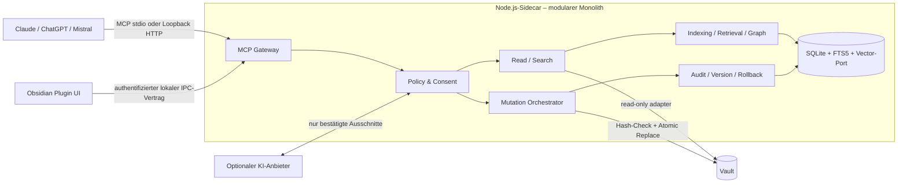

# ADR-000001: Tech-Stack und lokale Systemarchitektur

## Status

`APPROVED` — Stakeholder-Freigabe erteilt am 2026-07-30.

## Kontext

Second Brain ist ein Windows-first Obsidian-Plugin mit lokalem MCP-Server, inkrementeller
Indexierung, hybrider Suche und kontrollierten Mutationen. Der Stack muss Obsidian nativ
erweitern, ohne externe Pflichtdienste laufen und Trust Boundaries zwischen Vault-Inhalten,
Werkzeugen und KI-Clients erzwingen. Treiber: F-001–F-024 und NF-001–NF-014.

## Entscheidung

**TypeScript in einem npm-Workspace, Obsidian Plugin API im Plugin-Prozess und ein separater
lokaler Node.js-24-LTS-Sidecar als modularer Monolith.**

- TypeScript `strict`, ESM; Obsidian/Electron für UI, Node.js 24 LTS für Sidecar/CLI.
- Native Obsidian-Komponenten und CSS; kein SPA-Framework im MVP.
- Offizielles MCP TypeScript SDK; `stdio` als lokale Basis, optional loopback-only
  Streamable HTTP nach Client-Kompatibilitätsprüfung.
- Lokale SQLite-Datei mit FTS5; Vektoradapter hinter Port, konkrete Extension erst nach
  Windows-Packaging-Spike.
- Versionierte TypeScript-/Laufzeitverträge, intern JSON-RPC, extern MCP Tools/Resources.
- npm, esbuild, Vitest und ein Electron-/Playwright-E2E-Harness.
- Manuelles Plugin-Bundle plus prüfsummengesicherter Windows-Sidecar; keine Container.

Primärquellen: [Obsidian Developer Docs](https://docs.obsidian.md/Home),
[Plugin-Tutorial](https://docs.obsidian.md/Plugins/Getting%20started/Build%20a%20plugin),
[MCP SDK Server](https://ts.sdk.modelcontextprotocol.io/server),
[Node Releases](https://nodejs.org/en/about/previous-releases),
[SQLite FTS5](https://www.sqlite.org/fts5.html).

## Systemdesign

Trust Boundaries: Vault- und Provider-Inhalte sind Daten, nie Steueranweisungen. Nur Policy
darf autorisierte Aufrufe weitergeben. HTTP bindet ausschließlich Loopback. Persistenz bleibt
lokal. Das UI zeigt Consent, der Sidecar erzwingt ihn zusätzlich serverseitig.

## Begründung

TypeScript minimiert Sprachgrenzen zur offiziellen Obsidian API und zum MCP SDK. Node 24 ist
am 30.07.2026 LTS. Der Sidecar trennt Indexierung/MCP vom UI-Lebenszyklus. Native Obsidian UI
reduziert Bundle- und Accessibility-Komplexität. SQLite/FTS5 erfüllt lokale Volltextsuche.
Der Vector-Port begrenzt Windows-Binary- und Supply-Chain-Risiken.

## Betrachtete Alternativen

### Python-Sidecar — ✗ Abgelehnt

Gute RAG-Auswahl, aber zweite Runtime, zweites Typmodell und komplexere Windows-Verteilung.

### Verteilte Microservices/Container — ✗ Abgelehnt

Unabhängige Skalierung ist hier wertlos: Einzelnutzer, lokale Bereitstellung, keine
Ops-Kapazität. Zusätzliche Ports und Deployments widersprechen NF-010.

### Alles im Plugin-Prozess — ✗ Abgelehnt

MCP-Lebenszyklus und native Indexabhängigkeiten gefährden UI-Stabilität.

### TypeScript Plugin + Node-Sidecar — ✓ Gewählt

Ein Typmodell und klare Prozessgrenze. Trade-off: Installer, IPC-Versionierung und
Prozessüberwachung.

## Konsequenzen und Risiken

| Risiko | Wahrscheinlichkeit | Impact | Mitigation |
|---|---|---|---|
| Native SQLite-/Vektor-Binary inkompatibel | Mittel | Hoch | Adapter, Packaging-Spike, geprüfte Artefakte |
| Plugin/Sidecar driften | Mittel | Hoch | Handshake, Vertragsversion, read-only fallback |
| Loopback-Missbrauch | Mittel | Hoch | Session-Secret, Host-Prüfung, kein LAN-Bind |

Mobile kann nicht alle Sidecar-Funktionen lokal ausführen; Vektorbackend bleibt zunächst offen.

## Reversibilität

- [x] **Schwer reversibel** — Sprache und Prozessschnitt erfordern später Vertrags- und
  Packaging-Migration.

## NFR-Abdeckung

| NFR | Architekturmaßnahme |
|---|---|
| NF-001 | Hash-Check, atomare Writes und Recovery-Tests |
| NF-002 | Prepare/Confirm/Commit im Human-in-Modus |
| NF-003 | Audit-Journal und Einzel-Rollback |
| NF-004 | Tainted-Data-Modell und Injection-Regressionsset |
| NF-005 | Capability-basierte Werkzeuge und Policy Enforcement |
| NF-006 | Consent-Vertrag vor Datenfluss und Moduswechsel |
| NF-007 | ausschließlich lokale Produktpersistenz |
| NF-008 | versionierte Schemas, Fixtures und Migrationen |
| NF-009 | Windows-Paket und Windows-E2E |
| NF-010 | keine Pflicht-Cloud und keine Containerplattform |
| NF-011 | Chunk- und Fundstellen-IDs |
| NF-012 | geführtes Setup und konkrete Fehlerdiagnosen |
| NF-013 | native UI, Tastaturpfade und zugängliche Namen |
| NF-014 | MIT-Lizenz und Third-Party Notices |

## Implementierungshinweise

Keine Regel nur im UI erzwingen. Schemas an Prozessgrenzen laufzeitvalidieren. MCP-stdout
enthält nur Protokoll; Logs nach stderr. Abhängigkeiten locken, Sidecar-Artefakte hashen.

## Abhängige ADRs

ADR-000002 Prozessgrenzen; ADR-000003 Datenhaltung; ADR-000004 Sicherheit; ADR-000005 Branching.

---

## Übergabe: AR → UX

**Datum:** 2026-07-30  
**Von:** Software Architect (AR)  
**An:** UX Designer (UX)  
**Nächster Befehl:** `/ux second-brain`

### Übergebene Artefakte

| Artefakt-ID | Status | Pfad | Hinweise |
|---|---|---|---|
| ADR-000001–ADR-000005 | APPROVED | `architecture/` | Verbindlicher Stack, Prozessschnitt, Persistenz, Sicherheit und Branching |
| STRUCTURE | APPROVED | `architecture/STRUCTURE.md` | Verbindliche Projekt- und Modulstruktur |

### Kritische Informationen für Empfänger

Native Obsidian UI ist gesetzt. UX definiert Setup, Consent, Moduswechsel, Vorschau,
Konflikt, Audit und Rollback. Policy-Entscheidungen werden serverseitig erzwungen.

### Offene Fragen (vererbt)

| # | Frage | Ursprung | Kritikalität | An wen |
|---|---|---|---|---|
| 1 | Konkrete Mutationsbudgets für Human-on/out-of-the-Loop | REQ-000001 §7 | MAJOR | Stakeholder / Refinement |
| 2 | Anbieterbezogene Hinweise und Pflegeweg | REQ-000001 §7 | MAJOR | PM / BA |

### Nicht-Ziele (explizit ausgeschlossen)

Konkretes Interaction Design und Microcopy sind Aufgabe der UX-Phase.

### Empfehlungen

Sicherheitskritische Flows zuerst spezifizieren: Consent, Mutation Preview, Konflikt,
Audit und Rollback.

## Übergabe: AR → FE/BE

**Datum:** 2026-07-30  
**Von:** Software Architect (AR)  
**An:** Frontend- und Backend-Agenten (FE, BE)  
**Nächster Befehl:** `/refine second-brain 1`

### Übergebene Artefakte

| Artefakt-ID | Status | Pfad | Hinweise |
|---|---|---|---|
| ADR-000001–ADR-000005 | APPROVED | `architecture/` | Verbindliche Architekturentscheidungen |
| STRUCTURE | APPROVED | `architecture/STRUCTURE.md` | Projektstruktur, Abhängigkeitsrichtung und Standards |

### Kritische Informationen für Empfänger

Verbindlich sind TypeScript strict, Plugin/Sidecar-Grenze, serverseitige Policy,
SQLite/FTS5, versionierte Verträge und lokale Persistenz.

### Offene Fragen (vererbt)

| # | Frage | Ursprung | Kritikalität | An wen |
|---|---|---|---|---|
| 1 | Konkrete Vector-Extension für Windows | ADR-000001 | MAJOR | AR / Refinement-Spike |
| 2 | Erste verbindliche Client-Kompatibilitätsmatrix | REQ-000001 §7 | MAJOR | AR / Refinement |

### Nicht-Ziele (explizit ausgeschlossen)

Sprint-Zuschnitt und Aufwandsschätzung erfolgen im Refinement.

### Empfehlungen

Sprint 1 mit Setup, lokalem Index, Read/Search und Trust-Boundary-Grundlagen schneiden.

## Definition-of-Done-Selbstprüfung

- [x] ADR-000001 vollständig und durch Stakeholder freigegeben.
- [x] Architekturschema entschieden und Abweichung vom Microservices-Default begründet.
- [x] Wesentliche Architekturentscheidungen in ADR-000001–ADR-000005 dokumentiert.
- [x] Alternativen und Ablehnungsgründe dokumentiert.
- [x] Systemdesign-Diagramm vorhanden.
- [x] Projektstruktur in `STRUCTURE.md` definiert.
- [x] NF-001–NF-014 adressiert.
- [x] Container-Anforderungen nicht anwendbar; keine Container vorgesehen.
- [x] Architektur- und Projektindex aktualisiert.
