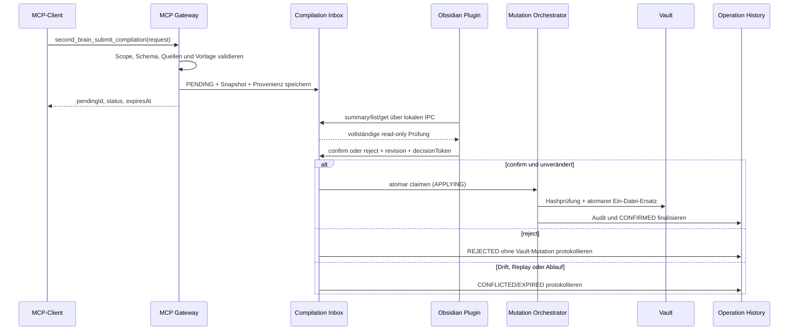

# ADR-000007: MCP-first Pending Confirmation für Wissenskompilierungen

## Status

`APPROVED` — Freigabe durch Folge-Command `/ux` am 2026-08-15 erteilt.

## Kontext

REQ-000002 und US-000017 ersetzen den manuellen Sprint-7-Kompilierungsablauf. Ein
autorisierter MCP-Client besitzt Quellen, Ziel und Kandidat bereits. Er muss den Vorschlag
direkt einreichen können; Obsidian ist anschließend Prüf- und Entscheidungsoberfläche.

Der aktuelle Bestand besitzt zwei Prozesswege:

- Der MCP-Server ist ein länger laufender `stdio`-Prozess.
- Das Obsidian-Plugin startet für IPC-Operationen jeweils einen kurzlebigen Sidecar-Prozess.

Beide verwenden die lokale SQLite-Datei. Der aktuelle `second_brain_prepare_compilation`-
Pfad erzeugt dagegen nur eine Mutation-Preview und erwartet, dass die UI dieselben
Parameter erneut erfasst. `template_previews` und `compilation_bindings` sind zudem nicht
vollständig begrenzt. Treiber sind REQ-000002 F-025–F-032 und NF-015–NF-017 sowie
RV-000008 K-001–K-005, UX-001, T-001 und P-001.

## Entscheidung

**Wir führen eine durable, vault-gebundene Compilation Inbox in der bestehenden lokalen
SQLite-Datenbank ein. MCP reicht Vorschläge ein; ausschließlich der Plugin-IPC-Vertrag darf
sie bestätigen oder verwerfen. Obsidian erkennt neue Einträge durch begrenztes Polling.**

Die Entscheidung erweitert ADR-000004 um einen asynchronen Human-in-the-Loop-Lebenszyklus.
Sie verändert weder den modularen Monolithen noch die bestehende Plugin-/Sidecar-Grenze und
öffnet keinen zusätzlichen Netzwerkport.

## Systemdesign



### Vertrauens- und Prozessgrenzen

```text
MCP-Client
  │ compilation.propose (keine Vault-Mutation)
  ▼
MCP Gateway ── validierter Vertrag ──► lokale SQLite Inbox
                                           ▲
                                           │ Plugin-only IPC
                                           ▼
Obsidian Pending List / Review ──► Decision Service ──► Mutation Orchestrator ──► Vault
```

- Client-ID und Vault-ID stammen aus der serverseitig etablierten Verbindung, nicht aus
  frei behaupteten Payload-Feldern.
- Kandidat, Quellen und Vorlageninhalt bleiben `untrusted data`.
- Das MCP-Werkzeug darf Vorschläge anlegen und ihren Status lesen, aber weder bestätigen
  noch verwerfen.
- Entscheidungstoken erscheinen weder in MCP-Antworten noch in Logs oder Historie.
- Der bestehende Vault-Scope, Markdown-only, Symlink-/Traversal-Schutz und Hashvergleich
  aus ADR-000004 bleiben verpflichtend.

## Versionierter Vertrag

Der externe und interne Contract wird auf `3.0.0` angehoben, weil der bisherige
Compilation-Flow fachlich ersetzt wird. Der Handshake muss ältere Plugin-/Sidecar-
Kombinationen in einen read-only Fehlerzustand versetzen statt still zu degradieren.

### Externes MCP

| Operation | Capability | Eingabe | Ausgabe | Seiteneffekt |
|---|---|---|---|---|
| `second_brain_submit_compilation` | `compilation.propose` | `clientRequestId`, ein Ziel, Kandidat, 1–20 Quellen mit erwarteten Hashes, optionale Template-Referenz | `pendingId`, `status`, `createdAt`, `expiresAt` | Persistiert lokale Kontrollmetadaten; verändert keinen Vault-Inhalt |
| `second_brain_compilation_status` | `compilation.read-own-status` | `pendingId` | Zustand und handlungsorientierter Fehler; kein Entscheidungstoken | Read-only |

`clientRequestId` ist je Client und Vault idempotent. Derselbe Schlüssel mit identischem
Payload liefert denselben Eintrag; abweichender Payload liefert `IDEMPOTENCY_CONFLICT`.
Der alte `second_brain_prepare_compilation`-Vertrag wird in Contract 3 nicht mehr als
primärer Flow angeboten. Eine zeitlich begrenzte Compatibility-Schicht darf ihn nur in die
Inbox übersetzen und darf keinen bestätigbaren Token an MCP zurückgeben.

### Plugin-IPC

| Operation | Eingabe | Ausgabe |
|---|---|---|
| `pending-compilation-summary` | Vault-Kontext | Anzahl, neueste Revision und älteste Ablaufzeit |
| `list-pending-compilations` | Cursor, Limit ≤ 50 | Metadatenliste ohne Kandidaten-Volltext |
| `get-pending-compilation` | `pendingId` | Ziel, Quellen, Diff, Links, Properties, Hashes, Vorlage, Warnungen, Revision und kurzlebiges Entscheidungstoken |
| `decide-pending-compilation` | `pendingId`, `revision`, `decision`, `decisionToken` | terminaler Zustand, Audit-ID bei Erfolg und konkreter Fehlercode |
| `list-templates` | Cursor, Limit ≤ 100 | stabile ID, Name, verfügbare Versionen und Hashes |
| `read-template` | ID und Version | Vorlagenmetadaten und Inhalt |

Payload-tragende IPC-Aufrufe verwenden JSON über `stdin`; Umgebungsvariablen enthalten nur
kleine, nicht geheime Startparameter. Erfolgsantworten bleiben genau ein validiertes JSON-
Dokument auf `stdout`, Fehler genau ein `ErrorResponse` auf `stderr`.

### Fachliche Fehlercodes

| Code | Bedeutung / Recovery |
|---|---|
| `COMPILATION_INVALID_SOURCE` | Betroffene Quelle fehlt, ist nicht Markdown oder liegt außerhalb des Vaults. |
| `COMPILATION_INVALID_TARGET` | Ziel fehlt, ist nicht Markdown, liegt außerhalb des Vaults oder es wurden mehrere Ziele gesendet. |
| `COMPILATION_TEMPLATE_NOT_FOUND` | Gespeicherte ID/Version/Hash-Kombination neu auswählen. |
| `COMPILATION_DRIFT` | Quelle, Ziel oder Vorlage hat sich geändert; neuen Vorschlag einreichen. |
| `CONFIRMATION_EXPIRED` | Prüfung ist abgelaufen; neuen Vorschlag einreichen. |
| `CONFIRMATION_ALREADY_DECIDED` | Eintrag wurde bereits bestätigt oder verworfen. |
| `PENDING_CAPACITY_REACHED` | Offene Inbox prüfen oder abgelaufene Einträge bereinigen. |
| `IDEMPOTENCY_CONFLICT` | Neue `clientRequestId` für einen inhaltlich anderen Vorschlag verwenden. |

Adapter dürfen diese Codes verständlich kontextualisieren, aber nicht auf ein generisches
`INVALID_QUERY` reduzieren.

## Zustandsautomat und Atomarität

```text
VALIDATION ──invalid──────────────► kein Inbox-Eintrag + feldbezogener Fehler
    │ valid
    ▼
 PENDING ──reject─────────────────► REJECTED
    ├──────expiry─────────────────► EXPIRED
    ├──────drift──────────────────► CONFLICTED
    └──────confirm/claim──────────► APPLYING
                                      ├── write + audit ──► CONFIRMED
                                      ├── safe failure ───► FAILED
                                      └── crash/recovery ─► CONFIRMED | INCOMPLETE
```

Bestätigen und Verwerfen laufen unter `BEGIN IMMEDIATE` mit einer bedingten Aktualisierung
auf `state = PENDING`, passender `revision`, ungeklärtem `decided_at`, gültiger Ablaufzeit
und passendem Hash des Entscheidungstokens. Genau eine Aktualisierung verbraucht die
Entscheidung; Replay verändert nichts.

Dateisystem und SQLite bilden keine gemeinsame Transaktion. Deshalb wird Bestätigung als
lokale Write-ahead-Saga ausgeführt:

1. Ziel, Quellen und Vorlage erneut lesen und gegen die gespeicherten Hashes prüfen.
2. Unter `BEGIN IMMEDIATE` den Eintrag atomar auf `APPLYING` claimen und Before-/After-Hash
   sowie Recovery-Payload festhalten.
3. Die eine Zieldatei über Temp-Datei und atomaren Replace schreiben.
4. Audit, Rollback-Bezug und `CONFIRMED` idempotent in einer DB-Transaktion finalisieren.
5. Bei Prozessstart jeden `APPLYING`-Eintrag wiederherstellen: After-Hash finalisiert
   `CONFIRMED`, Before-Hash wird `INCOMPLETE` ohne Änderung, ein fremder Hash wird
   `INCOMPLETE` mit Konflikt. Neuere Inhalte werden nie überschrieben.

## Persistenzmodell und Grenzen

Schema-Migration 6 führt mindestens folgende normalisierte Bereiche ein:

| Bereich | Zweck | Inhalt |
|---|---|---|
| `compilation_requests` | langlebiger Zustandskopf | IDs, State, Revision, Ziel, Kandidatenhash, Client-/Vault-Bezug, Zeiten, Fehler, Audit-ID |
| `compilation_payloads` | nur aktive/Recovery-Payloads | Kandidateninhalt, Diff, Before-/After-Inhalt; FK mit Cascade |
| `compilation_sources` | geprüfte Provenienz | Pfad, erwarteter und beobachteter Hash, Reihenfolge |
| `compilation_events` | kompakte Zustandsfolge | Zustand, Zeitpunkt, Fehlercode; kein Vault-Inhalt |
| `template_registry` | rebuildbarer Dateiindex | ID, Name, Version, Hash, Dateipfad, Erstellzeit |

Verbindliche Grenzen:

- maximal 50 gleichzeitig `PENDING`/`APPLYING`-Einträge pro Vault;
- maximal 64 MiB aktive Compilation-Payloads pro Vault;
- maximal 2 MiB Kandidat und 20 Quellen pro Vorschlag;
- `PENDING`-TTL 24 Stunden, Entscheidungstoken höchstens 15 Minuten und bei jedem
  erneuten Detailabruf rotierbar;
- keine Verdrängung eines offenen Eintrags: bei Kapazität wird die neue Einreichung mit
  `PENDING_CAPACITY_REACHED` abgewiesen;
- terminale Compilation-Payloads werden nach sicherer Finalisierung sofort entfernt;
  kompakte Events und das unveränderliche Audit bleiben erhalten;
- `template_previews`: höchstens 20 offene Einträge, TTL 15 Minuten;
- `mutation_previews`: bestehende Grenze 100 und TTL bleiben bestehen;
- `compilation_bindings` werden in Migration 6 in den neuen Inbox-Bereich überführt oder
  als verwaiste/verbrauchte Legacy-Daten gelöscht; neue Bindungen besitzen FK-Cascade.

Cleanup läuft bei Start und vor jedem Insert in einer kurzen Transaktion. Er markiert
abgelaufene offene Einträge zuerst als `EXPIRED` und löscht erst danach deren große
Payloads. `PENDING` oder `APPLYING` werden niemals aufgrund einer Zeilenreihenfolge
gelöscht.

## Projektlokale Vorlagen

Die Vorlagendateien sind Source of Truth unter:

```text
.second-brain/templates/<template-uuid>/
  manifest.json
  v000001-<sha256>.md
  v000002-<sha256>.md
```

- `manifest.json` enthält ID, Anzeigename, aktuelle Version und eine Liste der
  unveränderlichen Versionen; der Inhalt liegt ausschließlich in den `.md`-Dateien.
- Schreiben erfolgt über temporäre Datei, `fsync` soweit unterstützt und atomaren Rename.
- Eine `BEGIN IMMEDIATE`-Transaktion reserviert `(template_id, version)` eindeutig, bevor
  geschrieben wird. Crash-Recovery gleicht reservierte Datensätze und vorhandene Dateien
  anhand des Hashes ab.
- SQLite enthält nur einen rebuildbaren Registry-Index, nicht die alleinige Kopie.
- Indexierung, Suche und Kompilierungsquellen schließen `.second-brain/**` aus.
- List/Read/Select verwenden ID und Version; Name ist nur Anzeige und kein Schlüssel.

## Historie und Rollback-Projektion

Der Laufzeitvertrag unterscheidet mindestens:

```text
operationStatus = pending | applying | success | rejected | failed | incomplete | conflicted | expired
rollbackStatus  = not-applicable | available | rolled-back | blocked
```

Ein Rollback-Eintrag referenziert seine Ursprungs-Audit-ID. Nach erfolgreichem Rollback wird
der Ursprungsdatensatz als `rolled-back` projiziert; der Rollback-Vorgang selbst hat
`not-applicable`. Unterbrechungen werden aus `APPLYING`-Recovery abgeleitet und dürfen nie
als `success` erscheinen. Listen sind cursorbasiert, standardmäßig 50 und maximal 200
Einträge pro Aufruf.

## Obsidian-Signalisierung und UI-Grenze

Das Plugin fragt nur die kleine Summary ab:

- sofort bei Plugin-Start, Öffnen der Mutation-/Review-Ansicht und Workspace-Fokus;
- alle 2 Sekunden, solange die Pending-Ansicht sichtbar ist;
- alle 15 Sekunden, solange das Plugin geladen, die Ansicht aber nicht sichtbar ist;
- keine Timer nach `onunload` und höchstens ein Request gleichzeitig.

Eine steigende ungelesene Revision erzeugt genau eine Obsidian Notice und aktualisiert den
Badge. Die UI besteht aus Pending-Liste, fokussierter Detailprüfung und Historie. Der
generische Note-Change-Editor darf separat bestehen bleiben; technische Pfad- und
Volltextfelder erscheinen nicht im MCP-first-Compilation-Flow.

## Betrachtete Alternativen

### Manuelle Pfad- und Volltexteingabe im Plugin — ✗ Abgelehnt

Einfach zu implementieren, aber vom Stakeholder abgelehnt und kein MCP-first-Ablauf.

### Flüchtiger In-Memory-Queue mit direktem Push — ✗ Abgelehnt

Niedrige Latenz, verliert aber Vorschläge bei Prozessende und passt nicht zu den getrennten
MCP- und Plugin-Sidecar-Lebenszyklen.

### Zusätzlicher Loopback-WebSocket-/HTTP-Eventserver — ✗ Abgelehnt

Echter Push wäre möglich, erzeugt aber Authentifizierungs-, Port-, CSRF- und
Lebenszykluskomplexität ohne fachlichen Nutzen gegenüber einer lokalen Inbox.

### SQLite Inbox mit begrenztem Polling — ✓ Gewählt

Nutzt die vorhandene lokale Transaktionsgrenze, überlebt Neustarts und bleibt ohne neuen
Netzwerkpfad. Akzeptierter Trade-off ist eine Signalisierungslatenz von höchstens dem
jeweiligen Pollingintervall.

## Konsequenzen

### Positiv

- Der normale Nutzerflow enthält keine doppelte Pfad- oder Volltexteingabe.
- MCP- und Plugin-Prozess müssen nicht gleichzeitig leben.
- Entscheidung, Replay-Schutz, Drift und Recovery sind serverseitig erzwingbar.
- Template-, Preview- und Binding-Persistenz erhalten feste Grenzen.

### Negativ / Trade-offs

- Contract 3.0.0 benötigt Handshake- und Migrationsabdeckung.
- Polling erzeugt geringe lokale DB-Last und keine sofortige Push-Garantie.
- Die Write-ahead-Saga und Crash-Recovery erhöhen die Mutationskomplexität.

### Risiken

| Risiko | Wahrscheinlichkeit | Impact | Mitigation |
|---|---|---|---|
| Zwei Prozesse entscheiden denselben Eintrag | Mittel | Hoch | `BEGIN IMMEDIATE`, State-/Revision-Prädikat und einmaliger Tokenhash |
| Crash zwischen Dateiersatz und Audit | Gering | Hoch | persistenter `APPLYING`-Intent und hashbasierte Start-Recovery |
| Inbox füllt lokale Platte | Mittel | Mittel | 50 Einträge, 64-MiB-Budget, TTL und terminale Payload-Löschung |
| Polling erzeugt parallele Prozesse | Mittel | Mittel | Single-flight, Sichtbarkeitsintervalle und Summary-only-Vertrag |
| Template-Datei und Registry driften | Gering | Hoch | atomare Dateien, Reservierung und hashbasierter Rebuild |

## Reversibilität

- [x] **Schwer reversibel** — Contract, Zustandsnamen und Persistenzschema werden
  öffentliche beziehungsweise migrationspflichtige Grenzen. Polling kann später hinter
  demselben Inbox-Port durch Push ersetzt werden.

## Implementierungshinweise

- Neue Verantwortung in fokussierte Komponenten schneiden, nicht in
  `MutationView.onOpen` oder `startMcpServer` weiter anwachsen lassen.
- Empfohlene Grenzen innerhalb der bestehenden STRUCTURE:
  `mutations/compilation-inbox`, `mutations/compilation-decision`,
  `mutations/template-store`, `audit/operation-history`,
  `ui/compilations/pending-list` und `ui/compilations/pending-detail`.
- Contract-Schemas nach Domäne aufteilen und aus `packages/contracts` exportieren.
- Die Migration ist idempotent und besitzt Fixtures für Schema 5 → 6, Restart in
  `APPLYING`, volle Inbox und verwaiste Legacy-Bindings.
- Pflichtnachweise: MCP-Tooltest, getrennte MCP-/Plugin-Prozesse, Plugin-Restart,
  Confirm/Reject/Replay/Expiry/Drift, Template-Race, Incomplete-Recovery, Storage-Limits,
  konkrete Fehlercodes und headed Obsidian-E2E ohne manuelle Doppelerfassung.

## Abhängige ADRs

| ADR | Beziehung |
|---|---|
| ADR-000001 | Behält TypeScript, lokales Plugin/Sidecar und versionierte Verträge bei. |
| ADR-000002 | Inbox, Templates und History bleiben Module des lokalen Sidecars. |
| ADR-000003 | SQLite bleibt lokaler transaktionaler Store; Vault bleibt Source of Truth. |
| ADR-000004 | Erweitert Prepare/Confirm/Commit um asynchrone Einreichung und Recovery. |

## NFR-Abdeckung

| NFR | Architekturmaßnahme |
|---|---|
| NF-001 / NF-002 | Ein-Datei-Write-ahead-Saga, Hashprüfung und Plugin-only Entscheidung |
| NF-003 | unveränderliches Audit, korrekte Rollback-Relation und Recovery-Zustände |
| NF-004 / NF-005 | untrusted data, enges `compilation.propose`, keine MCP-Entscheidung |
| NF-007 | ausschließlich lokale Inbox, Vorlagen und Historie |
| NF-008 | Contract 3 Handshake und getestete Schema-5→6-Migration |
| NF-012 / NF-015 | Pending-Prüfung ohne Doppelerfassung und feldbezogene Fehler |
| NF-016 | durable Inbox und Start-Recovery |
| NF-017 | append-only Zustandsereignisse mit ID, Zeitpunkt und Ergebnis |

## Code-Referenzen der Ist-Analyse

| Pfad | Relevanz |
|---|---|
| `apps/sidecar/src/mcp-gateway/server.ts` | Aktuelle MCP-Toolliste und direkter Prepare-Compilation-Aufruf |
| `apps/sidecar/src/mutations/mutation-service.ts` | Aktuelle Preview-, Template-, Binding-, Confirm- und Audit-Persistenz |
| `apps/obsidian-plugin/src/ipc/node-setup-transport.ts` | Kurzlebiger CLI-IPC und aktueller Umgebungsvariablen-Payload |
| `apps/obsidian-plugin/src/ui/mutation-view.ts` | Manuelle Doppelerfassung und konzentrierter UI-Zustand |
| `packages/contracts/src/index.ts` | Aktuelle Compilation-, Template- und History-Verträge |

## Definition-of-Done-Selbstprüfung

- [x] Bestehender Tech-Stack und begründeter modularer Monolith bleiben unverändert.
- [x] Einreichung, Signalisierung, Zustandsabfrage, Confirm und Reject sind entschieden.
- [x] Atomarität, Replay, Drift, Crash-Recovery und Migration sind beschrieben.
- [x] Persistenz-, TTL-, Payload- und Listenlimits sind verbindlich festgelegt.
- [x] Template-Dateien, List/Read/Select und Race-Schutz sind entschieden.
- [x] History- und Rollback-Zustände sind eindeutig definiert.
- [x] NF-015–NF-017 und betroffene bestehende NFRs sind adressiert.
- [x] Alternativen und Ablehnungsgründe sind dokumentiert.
- [x] Systemdesign-Diagramm und konkrete Implementierungsgrenzen sind vorhanden.
- [x] `STRUCTURE.md` bleibt ausreichend; alle neuen Komponenten liegen unter bestehenden Modulpfaden.
- [x] Constitution geprüft; kein Konflikt und kein neuer externer Datenfluss.
- [x] Freigabe durch Folge-Command `/ux` am 2026-08-15 erteilt.

---

## Übergabe: AR → UX

**Datum:** 2026-08-15
**Von:** Software Architect (AR)
**An:** UX Designer (UX)
**Nächster Befehl:** `/ux second-brain`

### Übergebene Artefakte

| Artefakt-ID | Status | Pfad | Hinweise |
|---|---|---|---|
| ADR-000007 | APPROVED | `architecture/ADR-000007-mcp-first-pending-confirmation.md` | Verbindlicher Inbox-, Contract- und Zustandsentwurf nach Freigabe |
| US-000017 | APPROVED | `requirements/US-000017-mcp-first-pending-compilation.md` | Sieben fachliche Abnahmeszenarien |

### Kritische Informationen für Empfänger

- Die Compilation-UI beginnt mit einer Pending-Liste, nicht mit Pfad- und Volltextfeldern.
- Detailprüfung zeigt getrennte Quellen und Ziel, Provenienz, Diff, Links, Properties und
  konkrete Warnungen; Confirm und Reject sind gleichwertige Entscheidungen.
- Polling ist technische Signalisierung. UX entscheidet Badge, Notice, leere Zustände,
  Fokusführung und verständliche Recovery-Microcopy.

### Offene Fragen (vererbt)

Keine BLOCKER- oder MAJOR-Frage. Der optionale Obsidian-initiierte Komfortweg bleibt
außerhalb des Recovery-Slices.

### Nicht-Ziele

Keine konkrete visuelle Gestaltung oder fertige Microcopy in dieser ADR.

---

## Übergabe: AR → FE/BE

**Datum:** 2026-08-15
**Von:** Software Architect (AR)
**An:** Frontend- und Backend-Agenten (FE, BE)
**Nächster Befehl:** `/refine second-brain 7`

### Übergebene Artefakte

| Artefakt-ID | Status | Pfad | Hinweise |
|---|---|---|---|
| ADR-000007 | APPROVED | `architecture/ADR-000007-mcp-first-pending-confirmation.md` | Contract 3, Schema 6, Limits und Recovery |
| RM-000002 | APPROVED | `requirements/RM-000002-sprint-7-recovery-roadmap.md` | Architektur → UX → Refinement ist verbindliche Reihenfolge |

### Kritische Informationen für Empfänger

- Keine direkte Rückkehr zur Implementierung: UX und Refinement müssen zuerst Inbox-Flow,
  Tasks und End-to-End-Nachweise schneiden.
- Entscheidungen sind plugin-only; MCP erhält nie den Entscheidungstoken.
- Legacy-Tabellen, Template-Race, Incomplete-Historie und Storage-Regressionsfall gehören
  zur Migration und Pflichtabnahme.

### Offene Fragen (vererbt)

US-000006 referenziert noch US-000015 statt US-000017. Das ist Referenzpflege mit
Kritikalität MINOR und ändert den freigegebenen fachlichen Scope nicht.

### Nicht-Ziele

Keine Implementierung, kein UI-Layout und keine Sprint-Taskzerlegung in dieser Phase.
